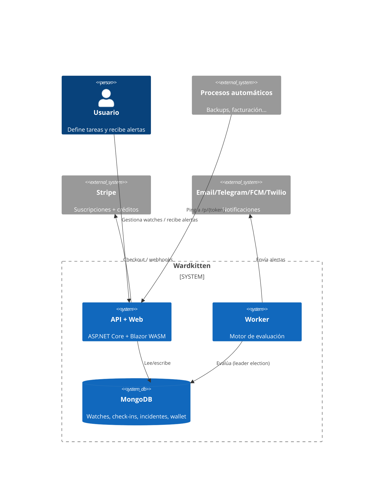

# C4 — Diagrama de contexto

## Descripción
Wardkitten es un watchdog SaaS. Los usuarios definen tareas; los procesos automáticos confirman por ping
y las manuales por la app/Telegram/email. Si una tarea incumple su programación, Wardkitten alerta por los
canales configurados.

## Diagrama (Mermaid)

## Notas
- API y Worker comparten Domain/Application/Infrastructure y la misma BBDD Mongo.
- El Worker evalúa bajo leader election (lease en Mongo) para no duplicar alertas al escalar.
- Despliegue en Kubernetes (ver `K8S/`), imágenes en GHCR, ArgoCD por entorno.
